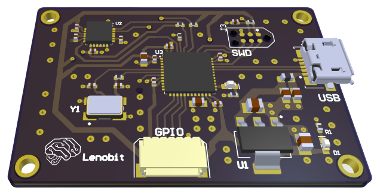
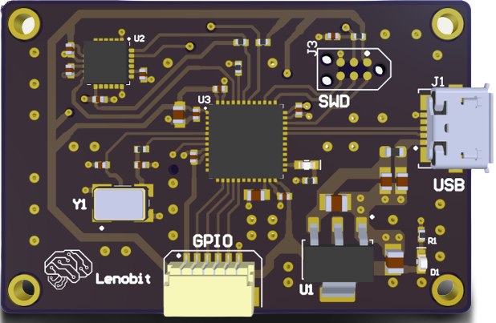

# Lenobitech PCB

## Project features

- Designed with Altium Designer & JLCPCB.
- Microcontroller stm34f Package UFQFPN-48.
- Sensor-Gyroscope-Accelerometer MPU-6050.
- Four-layer PCB layout and routing.
- 4-bit GPIO.
- USB Port for Power Supply.

